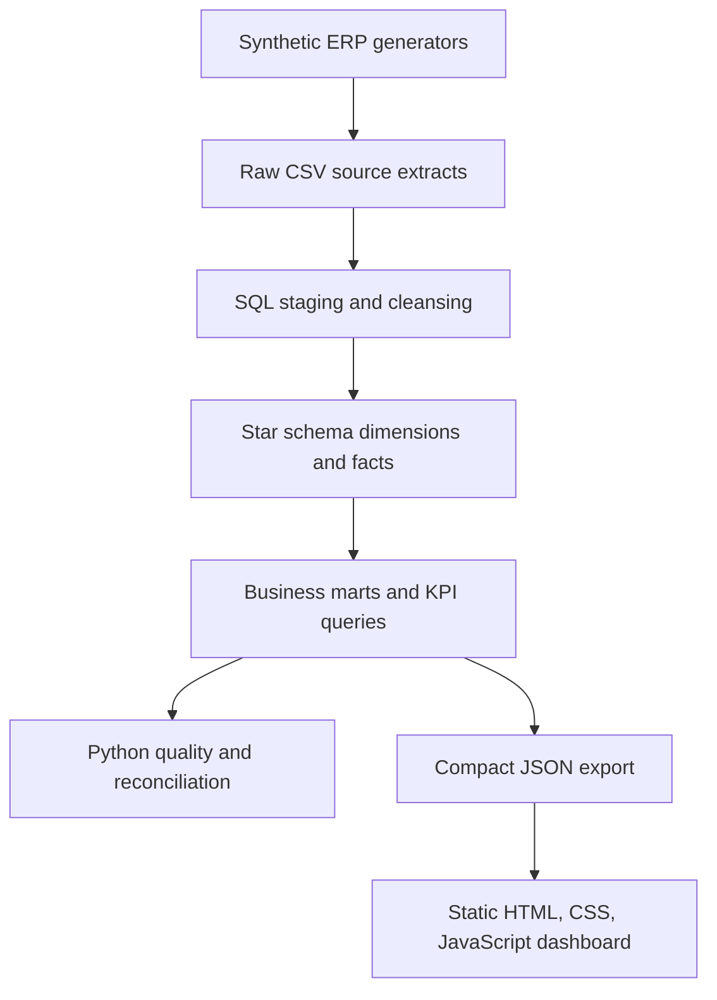
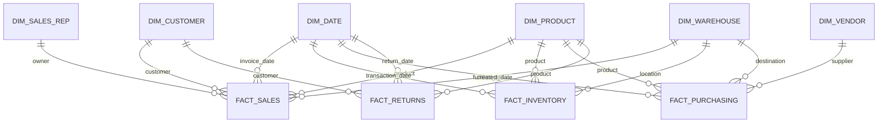

# Architecture and Data Model

## Pipeline

Raw preserves generated source columns and intentional data-quality exceptions. Staging standardizes dates/types, trims text, checks keys, and records rejected rows instead of silently losing them. The warehouse uses conformed dimensions and fact-specific grains. Marts apply governed business definitions. Validation checks relationships and totals. The dashboard reads precomputed JSON and works without a live database.

## Warehouse grains and relationships

| Fact | Grain | Additive measures |
|---|---|---|
| FactSales | One posted invoice line | quantity, revenue, COGS, gross profit, discount |
| FactInventory | One inventory movement per product, warehouse, timestamp | signed quantity, extended movement cost |
| FactPurchasing | One PO line | ordered, received, remaining quantity, committed value |
| FactReturns | One return line | returned quantity, return amount |

## Implementation plan
1. Scaffold and define business requirements, entities, grains, KPI contracts, and synthetic scenario assumptions.
2. Build modular master and transaction generators with reproducible configuration.
3. Add raw/staging/warehouse SQL and transformations, marts, validation, and reconciliation.
4. Export aggregated dashboard JSON and exception reports.
5. Build the nine-page responsive static application and verify local/file-hosted behavior.
6. Complete documentation, generated findings, and quality/visual review.

