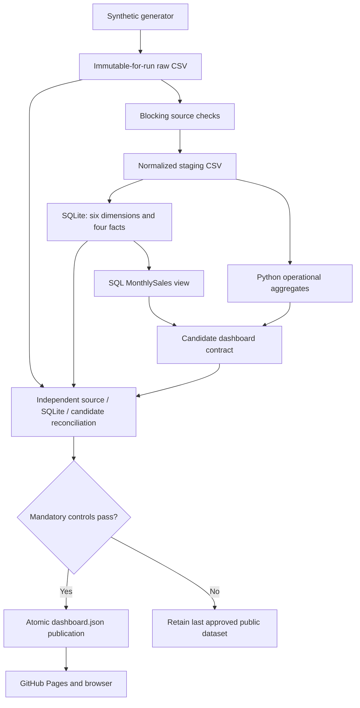

# Executing architecture and reference data model

## Implemented deployment

`etl/run_pipeline.py` is the orchestrator. Cleaning trims text and standardizes dates; it does not implement a quarantine service. Invalid source checks stop the run before model loading. `etl/warehouse.py` loads `sql/sqlite/warehouse.sql`, enforces primary/foreign keys, and atomically replaces the reference database. Missing dimension members fail the load; there is no implicit unknown-member substitution.

Monthly financial aggregates execute against the SQLite view. Customer, inventory, vendor, and service calculations use validated staging CSVs. Reconciliation reads original raw sources and independently queries the SQLite facts. No transformation reads staging and then silently switches back to raw for its ordinary analytics path.

## Executed grains

| Table | Grain | References |
|---|---|---|
| FactSales | InvoiceID + LineNumber | Date, Customer, Product, Warehouse, SalesRep |
| FactInventory | InventoryTransactionID | Date, Product, Warehouse |
| FactPurchasing | PONumber + LineNumber | Date, Product, Vendor, Warehouse |
| FactReturns | ReturnID | Date, Customer, Product |

The synthetic returns source has one row per ReturnID; no line number exists. The SQLite implementation uses natural keys and a full-rebuild Type 1 view of master data. Current customer region attribution is not historical territory attribution. DimDate currently covers 2020–2035; dates outside that reference range fail dimension resolution.

## Separate SQL Server design

`sql/01_database` through `sql/08_validation` describe a T-SQL deployment with surrogate-key dimensions. They are not the executing pipeline and do not constitute a tested SQL Server loader. Future work: idempotent loaders, constraints, late/unknown-member policy, effective-dated attributes, DECIMAL monetary storage, and measured query plans.

## Boundaries

The SQLite database is a build artifact, never exposed as a browser database API. Only synthetic JSON is public. No authentication, confidential-data authorization, CDC, or enterprise SLA is claimed. See engineering/security_and_scale.md for the private-deployment design.
